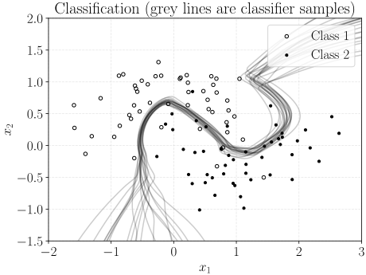

# Training partial Bayesian neural networks with sequential Monte Carlo samplers

TL;DR

- What is a partial Bayesian neural network (pBNN)? It is a type of neural network ``between a conventional neural network and a Bayesian neural network''. More precisely, it is a neural network with a subset of its weights being stochastic.
- How to train pBNNs? It's almost a standard latent variable model, hence any such a method applies.
- We represent the training via a Feynman--Kac formalism and use sequential Monte Carlo (SMC) samplers to 1) approximate the posterior distribution and 2) compute the deterministic weights of the pBNN. Note that the SMC samplers we use are not standard, but are modified for the pBNN training.

# Install

To install and run experiments, please do the following.

1. Create/use your favourite virtual environment. 
2. Clone the repository.
3. `pip install -r requirements.txt` or use the exact version `pip install -r requirements_freeze.txt`.
4. `pip install -e .`
5. (optional) Run the tests with `pytest`.

# Quick demonstrations

You can run any file in `./demos` to see how the method works for regression, classification, and inference in latent variable models. These demos can run in any standard PC/laptop without a GPU. The following figure is the output of the script `./demos/moon_ohsmc.py`. 



PS: if you get an error related to LaTeX, you can comment out the lines for rendering LaTeX.

# To exactly reproduce the numbers in the paper
See the `./experiments` directory. The experiments were run on a Slurm cluster, but they can be modified to run on your local computer. Please raise a Github Issue if you wish and I will help you.

# Citation
To cite our work, please use the following BibTeX entry. 

```bibtex
@inproceedings{Zhao2024PBNN,
  title = {On {F}eynman--{K}ac training of partial {B}ayesian neural networks},
  author = {Zhao, Zheng and Mair, Sebastian and Sch\"{o}n, Thomas B. and Sj\"{o}lund, Jens}, 
  booktitle = {Proceedings of The 26th International Conference on Artificial Intelligence and Statistics},
  year = {2024},
  volume = {238},
  publisher = {PMLR},
}
```
